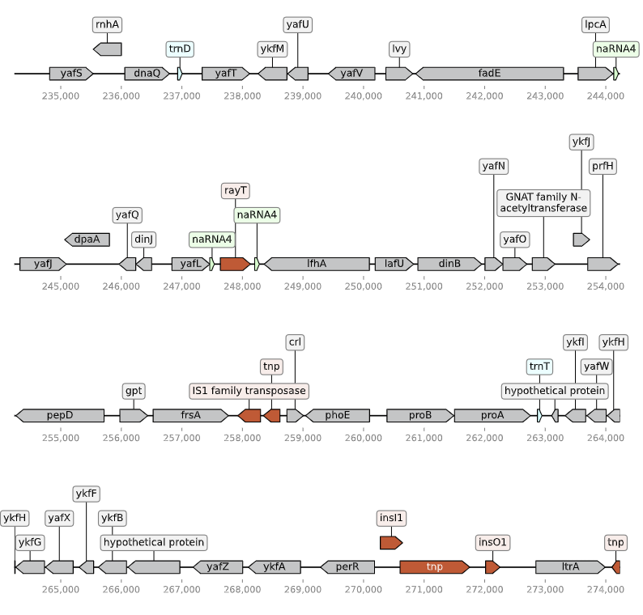

# 🧬 gff3-feature-visualization

A lightweight command-line tool for visualizing genomic features from **GFF3 annotation files** as publication-ready multi-page PDFs.

---

## ✨ Features

- Parse **GFF3** annotations using `gffutils`
- Visualize genomic regions with `dna_features_viewer`
- Multi-page plotting for long genomic regions
- Customizable layout (nucleotides per line, lines per page)
- Automatic feature coloring

---

## 📦 Installation

### 1. Create environment

```bash
mamba create -n dna_plot_env -c conda-forge python=3.10 dna_features_viewer gffutils pandas -y
```

### 2. Activate environment

```bash
conda activate dna_plot_env
```

---

## 🚀 Usage

```bash
python feature_showing.py \
  --gff_path GCF_000005845.gff3 \
  --start 234234 \
  --end 633259 \
  --contig_num NC_000913.3 \
  --length_per_line 10000 \
  --lines_per_page 5
```

---

## 📥 Input

- GFF3 annotation file (e.g., BAKTA output)
- Must include feature types and coordinates

---

## 📤 Output

A PDF file:

```
<sample>_<contig>_f<start>-<end>_cds.pdf
```

Below is an example visualization from *E. coli* (BAKTA annotation):



---

## ⚙️ Parameters

| Argument | Description |
|----------|------------|
| --gff_path | Path to GFF3 file |
| --start | Start position |
| --end | End position |
| --contig_num | Contig ID |
| --length_per_line | Nucleotides per line |
| --lines_per_page | Lines per page |

---

## 🎨 Feature Types Supported

- CDS
- rRNA / tRNA / tmRNA
- ncRNA
- CRISPR
- oriC / oriT
- regulatory_region
- transposase (auto-detected)

---

## 🧠 How It Works

1. Load GFF3 using gffutils
2. Extract features into DataFrame
3. Convert to GraphicFeature objects
4. Plot using dna_features_viewer

---

## ⚠️ Notes

- Coordinates are 1-based
- Ensure contig names match GFF3

---

